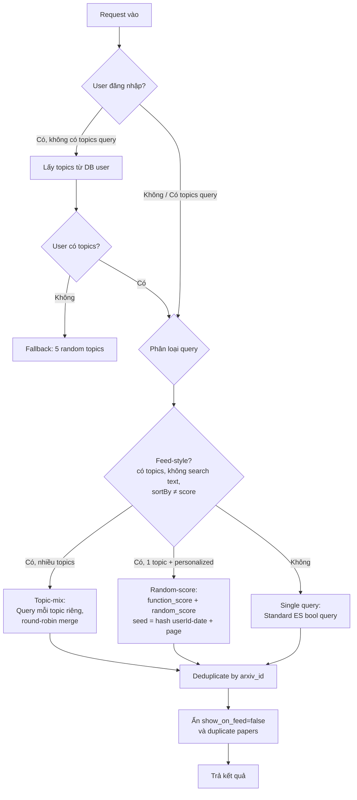
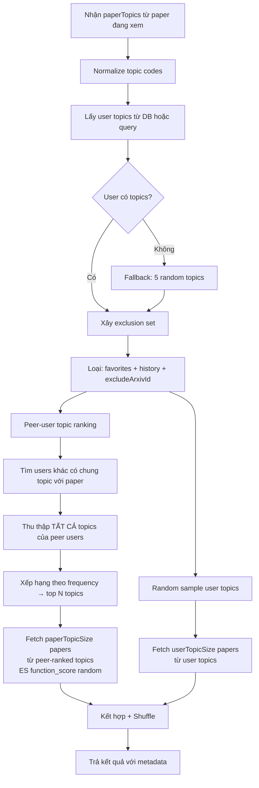
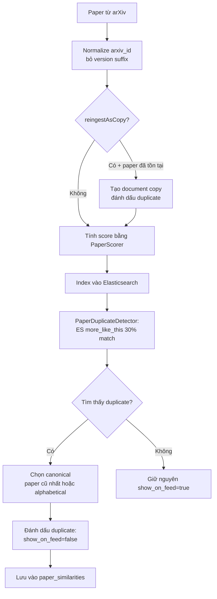
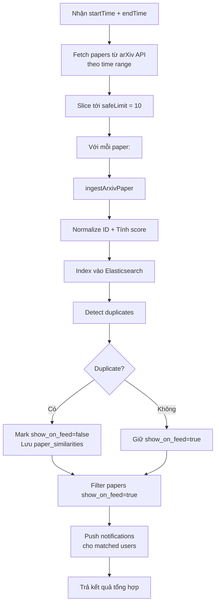

# 📚 API Documentation — arXiv Backend

> **Framework:** NestJS (TypeScript)  
> **Database:** PostgreSQL (TypeORM) + Elasticsearch  
> **Auth:** JWT Bearer Token (Passport)  
> **Swagger:** Available at `/api`  
> **Port:** `process.env.PORT` hoặc `3000`

---

## Mục lục

- [1. Auth Module](#1-auth-module)
- [2. Users Module](#2-users-module)
- [3. Papers Module](#3-papers-module)
- [4. Categories Module](#4-categories-module)
- [5. Topics Module](#5-topics-module)
- [6. Notifications Module](#6-notifications-module)
- [7. Statistics Module](#7-statistics-module)
- [8. Scheduler Module](#8-scheduler-module)
- [9. Data-Import Module](#9-data-import-module)
- [10. Internal Modules (không có API)](#10-internal-modules-không-có-api)
  - [AI Module](#ai-module)
  - [Common Module](#common-module)
  - [Database Module](#database-module)

---

## 1. Auth Module

> **Base path:** `/auth`  
> **Controller:** [auth.controller.ts](file:///c:/Users/ad/Documents/working/university/NMCNPM/backend/src/auth/auth.controller.ts)  
> **Service:** [auth.service.ts](file:///c:/Users/ad/Documents/working/university/NMCNPM/backend/src/auth/auth.service.ts)

### 1.1 `POST /auth/register` — Đăng ký tài khoản

| Mục | Chi tiết |
|-----|----------|
| **Ý nghĩa** | Tạo tài khoản người dùng mới |
| **Auth** | ❌ Không cần |
| **Input (Body)** | `RegisterDto` — `email: string` (bắt buộc, @IsEmail), `password: string` (bắt buộc), `full_name?: string` (tuỳ chọn) |
| **Output** | `201` — User object đã tạo / `400` — `"Email already exists"` |

**Chi tiết thuật toán:**
1. Gọi `usersService.findByEmail(email)` để kiểm tra email đã tồn tại chưa
2. Nếu tồn tại → throw `BadRequestException('Email already exists')`
3. Nếu chưa → gọi `usersService.create(registerDto)`:
   - Tạo bcrypt salt bằng `bcrypt.genSalt()`
   - Hash password với salt
   - Tạo entity User, lưu vào DB
4. Trả về User object đã lưu

---

### 1.2 `POST /auth/login` — Đăng nhập

| Mục | Chi tiết |
|-----|----------|
| **Ý nghĩa** | Xác thực email/password, trả về JWT access token |
| **Auth** | ❌ (Guard `LocalAuthGuard` xử lý xác thực) |
| **Input (Body)** | `LoginDto` — `email: string` (bắt buộc, @IsEmail), `password: string` (bắt buộc) |
| **Output** | `200` — `LoginResponseDto { user, access_token, expires_in }` / `401` — Invalid credentials |

**Chi tiết thuật toán:**
1. **LocalAuthGuard** kích hoạt `LocalStrategy.validate(email, pass)`:
   - Gọi `authService.validateUser(email, pass)`
   - Tìm user theo email → so sánh password bằng `bcrypt.compare(pass, user.password)`
   - Nếu khớp → trả về user (bỏ field `password`), gán vào `req.user`
   - Nếu sai → throw `UnauthorizedException('Invalid email or password')`
2. **Service `login(user)`**:
   - Tạo JWT access token: secret = `JWT_SECRET`, hết hạn `1d` (86400s)
   - Payload: `{ sub: userId, email }`
   - Load lại user với relations `['topics', 'topics.category']`
   - Xoá field `password` khỏi response
3. Trả về `{ user, access_token, expires_in: 86400 }`

---

### 1.3 `POST /auth/logout` — Đăng xuất

| Mục | Chi tiết |
|-----|----------|
| **Ý nghĩa** | Xác nhận đăng xuất phía client |
| **Auth** | ✅ JWT Bearer Token |
| **Input** | Không có |
| **Output** | `200` — `{ message: 'Successfully logged out.' }` |

**Chi tiết:** Server không lưu session. Client cần xóa access token sau khi gọi endpoint này.

---

### 1.4 `GET /auth/profile` — Xem profile

| Mục | Chi tiết |
|-----|----------|
| **Ý nghĩa** | Lấy thông tin user đang đăng nhập |
| **Auth** | ✅ JWT Bearer Token |
| **Input** | Không có (lấy userId từ JWT) |
| **Output** | `200` — User object (kèm topics, categories, không có password) / `401` — Unauthorized |

**Chi tiết:** Tìm user theo ID từ JWT payload, load relations `['topics', 'topics.category']`, xoá field `password`, trả về.

---

### Guards & Strategies

| Component | Chức năng |
|-----------|-----------|
| **JwtAuthGuard** | Yêu cầu JWT Bearer token hợp lệ trong header `Authorization` |
| **LocalAuthGuard** | Xác thực email/password qua Passport Local strategy |
| **OptionalJwtAuthGuard** | JWT tuỳ chọn — nếu có token thì xác thực, nếu không có thì `req.user = null` (dùng cho endpoints không bắt buộc đăng nhập) |
| **JwtStrategy** | Trích `sub` + `email` từ JWT payload → gán vào `req.user = { id, email }` |
| **LocalStrategy** | Đọc `email` + `password` từ body → gọi `validateUser()` |

---

## 2. Users Module

> **Base path:** `/users`  
> **Controller:** [users.controller.ts](file:///c:/Users/ad/Documents/working/university/NMCNPM/backend/src/users/users.controller.ts)  
> **Service:** [users.service.ts](file:///c:/Users/ad/Documents/working/university/NMCNPM/backend/src/users/users.service.ts)

### 2.1 `POST /users` — Tạo user

| Mục | Chi tiết |
|-----|----------|
| **Ý nghĩa** | Tạo user mới (dùng nội bộ, khác với register) |
| **Auth** | ❌ Không cần |
| **Input (Body)** | `CreateUserDto` — `email: string` (@IsEmail), `password: string`, `full_name?: string` |
| **Output** | User entity đã tạo (password đã hash) |

---

### 2.2 `GET /users` — Danh sách users

| Mục | Chi tiết |
|-----|----------|
| **Ý nghĩa** | Lấy tất cả users (có phân trang) |
| **Auth** | ✅ JWT |
| **Input (Query)** | `PaginationQueryDto` — `page?: number` (default 1), `size?: number` (default 20, max 100) |
| **Output** | `{ data: User[], meta: { page, size, total, totalPages } }` |

**Chi tiết:** Query `findAndCount` với relations `['topics', 'topics.category']`, sắp xếp `created_at DESC`.

---

### 2.3 `GET /users/me` — Profile user hiện tại

| Mục | Chi tiết |
|-----|----------|
| **Ý nghĩa** | Lấy thông tin user đang đăng nhập (alias tiện lợi của `/auth/profile`) |
| **Auth** | ✅ JWT |
| **Input** | Không có |
| **Output** | `200` — User object (kèm `topics[]`, không có `password`) / `401` — Unauthorized |

**Chi tiết:** Gọi `usersService.getMe(userId)` — load user + topics, xoá `password` trước khi trả về.

---

### 2.4 `GET /users/me/topics` — Topics đã chọn

| Mục | Chi tiết |
|-----|----------|
| **Ý nghĩa** | Lấy danh sách topics mà user hiện tại đã chọn theo dõi |
| **Auth** | ✅ JWT |
| **Input (Query)** | `UserTopicsQueryDto` — `page?: number`, `size?: number` (default 500, max 2000), `all?: boolean` (default false) |
| **Output** | `{ data: Topic[], meta: { page, size, total, totalPages } }` |

**Chi tiết:**
1. Load user với topics
2. Sắp xếp topics theo `code` alphabetically (`localeCompare`)
3. Nếu `all=true` → trả tất cả topics (không phân trang)
4. Nếu không → slice in-memory theo page/size

---

### 2.5 `PATCH /users/me/topics` — Thay thế toàn bộ topics

| Mục | Chi tiết |
|-----|----------|
| **Ý nghĩa** | Đặt lại toàn bộ danh sách topics theo dõi cho user (thay thế, không thêm) |
| **Auth** | ✅ JWT |
| **Input (Body)** | `SetUserTopicsDto` — `topic_codes: string[]` (@IsArray, @ArrayUnique, hỗ trợ comma-separated) |
| **Output** | Paginated topics response (tất cả topics sau khi cập nhật) |

**Chi tiết thuật toán:**
1. **Normalize** topic codes:
   - Trim mỗi code
   - Resolve qua `resolveArxivTopicCode()` — tra cứu trong `ARXIV_TAXONOMY_SEED` map
   - Deduplicate bằng `Set`
2. Gọi `categoriesService.ensureTopicsForCodes(normalizedCodes)` — tự động tạo topic/category nếu chưa có trong DB
3. Query tất cả topics theo codes (case-insensitive: `LOWER(topic.code) IN (:...lowerCodes)`)
4. Nếu có code không tìm thấy → throw `NotFoundException` liệt kê missing codes
5. **Thay thế** `user.topics` hoàn toàn bằng danh sách mới
6. Đặt `user.isFirstLogged = false` (đánh dấu user đã chọn topics lần đầu)
7. Lưu user, trả về tất cả topics

---

### 2.6 `POST /users/me/topics/:topicId` — Thêm 1 topic

| Mục | Chi tiết |
|-----|----------|
| **Ý nghĩa** | Thêm 1 topic vào danh sách theo dõi |
| **Auth** | ✅ JWT |
| **Input (Param)** | `topicId: number` |
| **Output** | Paginated topics (tất cả) |

**Chi tiết:** Tìm topic theo ID, kiểm tra trùng, nếu chưa có thì thêm vào `user.topics` rồi save.

---

### 2.7 `DELETE /users/me/topics/:topicId` — Bỏ theo dõi 1 topic

| Mục | Chi tiết |
|-----|----------|
| **Ý nghĩa** | Xoá 1 topic khỏi danh sách theo dõi |
| **Auth** | ✅ JWT |
| **Input (Param)** | `topicId: number` |
| **Output** | Paginated topics (tất cả) |

---

### 2.8 `GET /users/me/favorites` — Papers yêu thích

| Mục | Chi tiết |
|-----|----------|
| **Ý nghĩa** | Lấy danh sách papers mà user đã đánh dấu yêu thích |
| **Auth** | ✅ JWT |
| **Input (Query)** | `PaginationQueryDto` — `page?, size?` |
| **Output** | `{ data: Paper[] (từ Elasticsearch), meta: {...} }` |

**Chi tiết thuật toán:**
1. Query bảng `user_favorites` theo `user_id`, sắp xếp `created_at DESC`, phân trang
2. Lấy danh sách `arxiv_id` từ kết quả
3. Fetch chi tiết paper từ **Elasticsearch** bằng `papersService.getElasticsearchPapersByArxivIds(arxivIds)`
4. Trả về paginated response với dữ liệu paper đầy đủ từ ES

> [!NOTE]
> Bảng `user_favorites` chỉ lưu `arxiv_id` reference. Dữ liệu paper thực tế được lấy từ Elasticsearch tại thời điểm đọc.

---

### 2.9 `POST /users/me/favorites/:paperId` — Thêm yêu thích

| Mục | Chi tiết |
|-----|----------|
| **Ý nghĩa** | Đánh dấu 1 paper là yêu thích |
| **Auth** | ✅ JWT |
| **Input (Param)** | `paperId: string` (arxiv_id) |
| **Output** | Paginated favorites (trang 1) |

**Chi tiết:** Kiểm tra unique constraint `(user_id, arxiv_id)`. Nếu chưa có thì tạo `UserFavorite`, trả về trang đầu favorites.

---

### 2.10 `DELETE /users/me/favorites/:paperId` — Bỏ yêu thích

| Mục | Chi tiết |
|-----|----------|
| **Ý nghĩa** | Xoá paper khỏi danh sách yêu thích |
| **Auth** | ✅ JWT |
| **Input (Param)** | `paperId: string` (arxiv_id) |
| **Output** | Paginated favorites (trang 1) |

---

### 2.11 `GET /users/me/you-might-like` — Gợi ý papers

| Mục | Chi tiết |
|-----|----------|
| **Ý nghĩa** | Gợi ý papers cá nhân hoá cho user (delegates tới `PapersService.getYouMightLike`) |
| **Auth** | ✅ JWT |
| **Input (Query)** | Xem API 3.4 (`YouMightLikeQueryDto`) |
| **Output** | Xem API 3.4 |

---

### 2.12 `GET /users/me/history` — Lịch sử đọc

| Mục | Chi tiết |
|-----|----------|
| **Ý nghĩa** | Lấy lịch sử papers user đã xem |
| **Auth** | ✅ JWT |
| **Input (Query)** | `PaginationQueryDto` |
| **Output** | `{ data: Paper[] (từ ES), meta: {...} }` |

**Chi tiết:** Tương tự favorites — query bảng `user_paper_history`, lấy arxiv_ids, fetch từ Elasticsearch.

---

### 2.13 `POST /users/me/history/:paperId` — Ghi lịch sử đọc

| Mục | Chi tiết |
|-----|----------|
| **Ý nghĩa** | Ghi nhận user đã xem 1 paper |
| **Auth** | ✅ JWT |
| **Input (Param)** | `paperId: string` (arxiv_id) |
| **Output** | Paginated history (trang 1) |

**Chi tiết:**
- Nếu đã có record `(user_id, arxiv_id)` → **cập nhật** `viewed_at` = `new Date()` (ghi nhận re-visit)
- Nếu chưa có → tạo mới `UserPaperHistory`

---

### 2.14 `GET /users/:id` — Lấy user theo ID

| Mục | Chi tiết |
|-----|----------|
| **Ý nghĩa** | Lấy thông tin 1 user cụ thể |
| **Auth** | ✅ JWT |
| **Input (Param)** | `id: string` (UUID) |
| **Output** | User entity (kèm topics, categories) / `404` |

---

### 2.15 `PATCH /users/:id` — Cập nhật user

| Mục | Chi tiết |
|-----|----------|
| **Ý nghĩa** | Cập nhật thông tin user |
| **Auth** | ✅ JWT |
| **Input** | Param: `id`, Body: `UpdateUserDto` (partial — email?, password?, full_name?) |
| **Output** | Updated User entity |

---

### 2.16 `DELETE /users/:id` — Xoá user

| Mục | Chi tiết |
|-----|----------|
| **Ý nghĩa** | Xoá tài khoản user |
| **Auth** | ✅ JWT |
| **Input (Param)** | `id: string` (UUID) |
| **Output** | Void |

---

## 3. Papers Module

> **Base path:** `/papers`  
> **Controller:** [papers.controller.ts](file:///c:/Users/ad/Documents/working/university/NMCNPM/backend/src/papers/papers.controller.ts)  
> **Service:** [papers.service.ts](file:///c:/Users/ad/Documents/working/university/NMCNPM/backend/src/papers/papers.service.ts)  
> **Duplicate Service:** [paper-duplicates.service.ts](file:///c:/Users/ad/Documents/working/university/NMCNPM/backend/src/papers/paper-duplicates.service.ts)

> Papers được lưu và phục vụ chính từ **Elasticsearch** (index `papers`). Dùng `GET /papers/es/search` để list/tìm kiếm.

### 3.1 `GET /papers/es/search` — Tìm kiếm Elasticsearch

| Mục | Chi tiết |
|-----|----------|
| **Ý nghĩa** | Tìm kiếm papers từ Elasticsearch — hỗ trợ feed cá nhân hoá, tìm theo text, đa topic |
| **Auth** | 🔶 Tuỳ chọn (OptionalJwtAuthGuard — có token thì cá nhân hoá, không có cũng OK) |
| **Input (Query)** | `PaperFilterDto` — `page?`, `size?`, `topics?: string[]`, `q?: string`, `title?: string`, `author?: string`, `abstract?: string`, `sortBy?: 'date'\|'score'` |
| **Output** | `{ data: Paper[], meta: {...}, personalized: boolean, fallback: boolean, selectedTopics: string[] }` |

**Chi tiết thuật toán (3 chiến lược):**



1. **Topic-mix** (feed + nhiều topics): Query ES riêng cho mỗi topic → round-robin merge kết quả → đảm bảo đa dạng topic
2. **Random-score** (feed + cá nhân + 1 topic): ES `function_score` với `random_score`, seed = `hash(userId-date) + page` → shuffle ổn định theo ngày
3. **Single query** (tìm text hoặc sort by score): Standard ES bool query

---

### 3.4 `GET /papers/you-might-like` — Gợi ý cá nhân

| Mục | Chi tiết |
|-----|----------|
| **Ý nghĩa** | Thuật toán gợi ý papers dựa trên topics của paper đang xem + topics user theo dõi + hành vi cộng đồng |
| **Auth** | ✅ JWT |
| **Input (Query)** | `YouMightLikeQueryDto` — `paperTopics: string[]` (bắt buộc, comma-separated), `size=10` (max 20), `paperTopicSize=8` (max 15), `userTopicSize=2` (max 10), `topPaperTopics=3` (max 10), `excludeArxivId?: string`, `userTopics?: string[]` |
| **Output** | `{ data: [{...paper, recommendation_type, matched_topic, es_score, source}], meta: {...}, paperTopics, rankedPeerTopics, sampledUserTopics, ... }` |

**Chi tiết thuật toán gợi ý:**



1. **Normalize** topic codes (lowercase prefix, deduplicate)
2. **Resolve user topics**: từ query override hoặc từ DB user; fallback 5 random nếu không có
3. **Build exclusion set**: arxiv_ids từ favorites + history + excludeArxivId
4. **Peer-user topic ranking**: Tìm tất cả users (trừ current) có chung ≥1 topic với paper → thu thập TẤT CẢ topics của họ → xếp hạng theo tần suất → lấy top N (`topPaperTopics=3`)
5. Fetch `paperTopicSize` (8) papers từ peer-ranked topics qua ES `function_score(random_score)`, round-robin
6. Fetch `userTopicSize` (2) papers từ random-sampled user topics (loại papers đã thấy)
7. **Shuffle** kết quả cuối cùng

---

### 3.5 `GET /papers/es/:arxivId/similar` — Papers tương tự

| Mục | Chi tiết |
|-----|----------|
| **Ý nghĩa** | Lấy papers tương tự (dựa trên bảng `paper_similarities`) |
| **Auth** | ❌ Không cần |
| **Input** | Param: `arxivId`, Query: `limit?: number` (1-50, default 10) |
| **Output** | `{ data: SimilarPaperItem[] }` — mỗi item có `{ arxiv_id, title, abstract, authors, similarity, type }` |

**Chi tiết:**
1. Normalize arxivId (bỏ version suffix)
2. Nếu paper chính là duplicate → trả rỗng
3. Query bảng `paper_similarities` (cả 2 chiều: `arxiv_id = id OR similar_arxiv_id = id`)
4. Sắp xếp theo `similarity DESC`, lấy tối đa `limit`
5. Fetch chi tiết paper từ Elasticsearch
6. Type: `'exact'` | `'near'` | `'similar'` | `'related'`

---

### 3.6 `GET /papers/es/:arxivId` — Lấy paper từ ES

| Mục | Chi tiết |
|-----|----------|
| **Ý nghĩa** | Lấy chi tiết 1 paper — tìm từ nhiều nguồn (ES → arXiv API) |
| **Auth** | ❌ Không cần |
| **Input (Param)** | `arxivId: string` |
| **Output** | Paper object + `{ similarCount: number }` / `404` |

**Chi tiết (cascading lookup):**
1. Try direct ES get by normalized arxivId
2. Nếu không tìm thấy → try ES search by `arxiv_id` terms query
3. Nếu vẫn không → fetch live từ arXiv API (`https://export.arxiv.org/api/query?id_list=...`), parse XML
4. Đếm similar papers qua `PaperDuplicatesService.countSimilarPapers()`
5. Throw 404 nếu tất cả sources đều fail

---

### 3.7 `GET /papers/arxiv/search` — Tìm trên arXiv theo topics

| Mục | Chi tiết |
|-----|----------|
| **Ý nghĩa** | Proxy search tới arXiv API theo danh mục |
| **Auth** | ❌ Không cần |
| **Input (Query)** | `ArxivPapersQueryDto` — `topics: string` (comma-separated, bắt buộc), `page?`, `size?` |
| **Output** | `{ data: ArxivPaperDto[], meta: {...}, source: url, selectedTopics }` |

**Chi tiết:**
1. Build query: `cat:cs.AI OR cat:cs.CV ...`
2. Call arXiv API: `https://export.arxiv.org/api/query?search_query=...&sortBy=submittedDate&sortOrder=descending`
3. Parse XML response bằng regex-based parser
4. Trả về structured data

**ArxivPaperDto format:**
```json
{
  "id": "2307.09288v2",
  "arxiv_id": "2307.09288",
  "title": "...",
  "summary": "...",
  "authors": ["Author1", "Author2"],
  "pdfLink": "http://arxiv.org/pdf/2307.09288v2",
  "publishedDate": "2023-07-18T17:59:08Z",
  "primaryCategory": "cs.CL",
  "allCategories": ["cs.CL", "cs.AI"]
}
```

---

### 3.8 `GET /papers/arxiv/time-range` — Tìm arXiv theo khoảng thời gian

| Mục | Chi tiết |
|-----|----------|
| **Ý nghĩa** | Tìm papers trên arXiv trong khoảng ngày cụ thể |
| **Auth** | ❌ Không cần |
| **Input (Query)** | `ArxivTimeQueryDto` — `startDate: YYYY-MM-DD` (bắt buộc), `endDate: YYYY-MM-DD` (bắt buộc), `page?`, `size?` |
| **Output** | `{ data: ArxivPaperDto[], meta, source, timeRange: { startDate, endDate } }` |

**Chi tiết:** Build arXiv query `submittedDate:[YYYYMMDD000000 TO YYYYMMDD235959]`, fetch + parse XML.

---

### 3.9 `GET /papers/arxiv/feed` — Feed cá nhân từ arXiv

| Mục | Chi tiết |
|-----|----------|
| **Ý nghĩa** | Lấy feed papers từ arXiv dựa trên topics user đã chọn |
| **Auth** | ✅ JWT |
| **Input (Query)** | `PaginationQueryDto` |
| **Output** | `{ data, meta, source, selectedTopics, fallback }` |

**Chi tiết:** Load user topics từ DB → nếu không có thì fallback 5 random → gọi arXiv API theo topic codes.

---

### 3.10 `POST /papers/calculate-scores` — Tính điểm tất cả papers

| Mục | Chi tiết |
|-----|----------|
| **Ý nghĩa** | Chạy thuật toán tính điểm cho tất cả papers trong DB |
| **Auth** | ❌ Không cần |
| **Input** | Không có |
| **Output** | `{ message: "Successfully updated scores for N papers" }` |

**Chi tiết thuật toán tính điểm (PaperScorer):**

```
total_score = Σ (component_score × weight)
```

| Component | Weight | Công thức |
|-----------|--------|-----------|
| **Citation** | 0.35 | `(0.6 × min(citationsPerYear/10, 1) + 0.4 × min(totalCitations/50, 1)) × 100` |
| **Recency** | 0.20 | Exponential decay, half-life = 730 ngày (2 năm). Bonus cho papers mới update |
| **Author** | 0.20 | Avg top 3 authors: `hIndex/50×40 + citations/1000×30 + papers/100×20 + coauthors/50×10` |
| **Engagement** | 0.15 | `views/1000×25 + downloads/500×35 + bookmarks/100×25 + comments/20×15` + conversion bonus |
| **Quality** | 0.10 | Venue score (NeurIPS/ICML=30...) + abstract length bonus + code/dataset bonus + version bonus |

**Penalties:**
- Paper >3 năm + 0 citations → ×0.7
- Abstract <50 ký tự → ×0.8
- Single author → ×0.9

**Ranks:** ≥80 Excellent, ≥65 Very Good, ≥50 Good, ≥35 Average, <35 Below Average

---

### 3.11 `POST /papers/:id/calculate-score` — Tính điểm 1 paper

| Mục | Chi tiết |
|-----|----------|
| **Ý nghĩa** | Tính điểm cho 1 paper cụ thể |
| **Auth** | ❌ Không cần |
| **Input (Param)** | `id: string` (UUID hoặc arxiv_id) |
| **Output** | `{ paper_id, score_details: { total_score, component_scores, rank } }` |

---

### 3.12 `GET /papers/es/:arxivId/related` — Papers liên quan (MLT)

| Mục | Chi tiết |
|-----|----------|
| **Ý nghĩa** | Tìm papers liên quan bằng Elasticsearch More Like This |
| **Auth** | ❌ Không cần |
| **Input** | Param: `arxivId`, Query: `limit?` (default 5) |
| **Output** | Array of paper objects |

**Chi tiết thuật toán:** ES `more_like_this` query trên fields `[title, abstract, categories]`, dùng paper làm "like" document:
- `min_term_freq: 1` — thuật ngữ phải xuất hiện ít nhất 1 lần
- `max_query_terms: 25` — tối đa 25 terms trong query
- Loại `is_duplicated=true`

---

### 3.13 `GET /papers/es/duplicates/list` — Danh sách papers trùng lặp

| Mục | Chi tiết |
|-----|----------|
| **Ý nghĩa** | Liệt kê papers đã bị đánh dấu là bản trùng |
| **Auth** | ❌ Không cần |
| **Input (Query)** | `page?`, `size?`, `parentId?` |
| **Output** | `PaginatedResponse` chứa duplicate papers |

**Chi tiết:** ES search `is_duplicated=true`, optional filter `parent_id_duplicate`, sort `created_at DESC`.

---

### 3.14 `POST /papers/es/check-duplicate` — Kiểm tra trùng lặp

| Mục | Chi tiết |
|-----|----------|
| **Ý nghĩa** | Kiểm tra xem paper có trùng với papers hiện có không (fuzzy matching) |
| **Auth** | ❌ Không cần |
| **Input (Body)** | `{ title: string, abstract: string }` |
| **Output** | `Array<{ score: number, paper: object }>` (top 5 matches) |

**Chi tiết:** ES `more_like_this` trên `[title, abstract]` với `minimum_should_match: '85%'`, loại `is_duplicated=true`.

---

### 3.15 `GET /papers/:id` — Lấy paper theo ID

| Mục | Chi tiết |
|-----|----------|
| **Ý nghĩa** | Lấy chi tiết paper — cascading lookup qua 3 nguồn |
| **Auth** | ❌ Không cần |
| **Input (Param)** | `id: string` (UUID hoặc arxiv_id) |
| **Output** | Paper object + `{ source: 'database' \| 'elasticsearch' \| 'arxiv' }` |

**Chi tiết (cascading lookup):**
1. Nếu `id` là UUID → tìm trong DB
2. Nếu không → normalize arxiv_id → tìm DB bằng arxiv_id
3. Nếu không có trong DB → try Elasticsearch
4. Nếu không có trong ES → try live arXiv API
5. Mỗi kết quả gắn tag `source`

---

### 3.16 `PATCH /papers/:id` — Cập nhật paper

| Mục | Chi tiết |
|-----|----------|
| **Ý nghĩa** | Cập nhật thông tin paper |
| **Auth** | ❌ Không cần |
| **Input** | Param: `id` (UUID/arxiv_id), Body: `UpdatePaperDto` (partial) |
| **Output** | Updated Paper entity |

---

### 3.17 `DELETE /papers/:id` — Xoá paper

| Mục | Chi tiết |
|-----|----------|
| **Ý nghĩa** | Xoá paper khỏi database |
| **Auth** | ❌ Không cần |
| **Input (Param)** | `id: string` |
| **Output** | Removed Paper entity |

---

### 3.18 `POST /papers/:id/versions` — Thêm version

| Mục | Chi tiết |
|-----|----------|
| **Ý nghĩa** | Thêm phiên bản mới cho paper |
| **Auth** | ❌ Không cần |
| **Input** | Param: `id`, Body: `CreatePaperVersionDto` — `version_number: int≥1`, `title: string(500)`, `abstract: string`, `pdf_url: string(512)`, `source_pack_url?`, `size_bytes?`, `change_log?` |
| **Output** | Saved PaperVersion entity |

---

### 3.19 `GET /papers/:id/versions` — Danh sách versions

| Mục | Chi tiết |
|-----|----------|
| **Ý nghĩa** | Lấy tất cả versions của paper |
| **Auth** | ❌ Không cần |
| **Input** | Param: `id`, Query: `PaginationQueryDto` |
| **Output** | `PaginatedResponse<PaperVersion>` — sắp xếp `version_number ASC` |

---

### 3.20 `POST /papers/:id/topics` — Gắn topic cho paper

| Mục | Chi tiết |
|-----|----------|
| **Ý nghĩa** | Liên kết paper với 1 topic |
| **Auth** | ❌ Không cần |
| **Input** | Param: `id`, Body: `AddPaperTopicDto` — `topic_id: int`, `is_primary?: boolean` |
| **Output** | Saved PaperTopic entity |

---

### 3.21 `DELETE /papers/:id/topics/:topicId` — Bỏ topic khỏi paper

| Mục | Chi tiết |
|-----|----------|
| **Ý nghĩa** | Xoá liên kết paper-topic |
| **Auth** | ❌ Không cần |
| **Input** | Param: `id`, `topicId` |
| **Output** | Void / `404` nếu không tìm thấy |

---

### Paper Duplicate Detection (PaperDuplicatesService)

**Hàm `ingestArxivPaper(paper, options?)`** — Pipeline nhập papers từ arXiv cron:



**Thuật toán phát hiện trùng lặp (PaperDuplicateDetector):**

| Bước | Logic |
|------|-------|
| 1. **Metadata check** | Exact ID match (id/arxiv_id/doi) = 100 điểm. Nếu không: `titleSimilarity × 70 + authorSimilarity × 30` |
| 2. **Content check** | Jaccard similarity trên abstract (word-level) × 100 |
| 3. **Final score** | `metadata × 0.6 + content × 0.4` |
| 4. **Classification** | ≥90 = `'near'`, ≥70 = `'similar'`, ≥50 = `'related'` |

**String similarity:** `Jaccard (word-level) × 0.4 + Dice coefficient (bigram-level) × 0.6`

**Author similarity:** Overlap ratio + partial substring matching (xử lý "John Doe" ≈ "John A. Doe")

---

## 4. Categories Module

> **Base path:** `/categories`  
> **Controller:** [categories.controller.ts](file:///c:/Users/ad/Documents/working/university/NMCNPM/backend/src/categories/categories.controller.ts)  
> **Service:** [categories.service.ts](file:///c:/Users/ad/Documents/working/university/NMCNPM/backend/src/categories/categories.service.ts)

### 4.1 `GET /categories` — Danh sách categories

| Mục | Chi tiết |
|-----|----------|
| **Ý nghĩa** | Lấy tất cả categories dạng cây (kèm topics lồng nhau) |
| **Auth** | ❌ Không cần |
| **Input** | Không có |
| **Output** | `Category[]` — sắp xếp `title ASC`, topics theo `code ASC` |

---

### 4.2 `POST /categories/sync-arxiv` — Đồng bộ từ arXiv.org

| Mục | Chi tiết |
|-----|----------|
| **Ý nghĩa** | Crawl trang taxonomy arXiv.org, parse HTML, upsert categories + topics vào DB |
| **Auth** | ✅ JWT |
| **Input** | Không có |
| **Output** | `SyncArxivTaxonomyResponseDto { source, categoriesImported, topicsImported, warning? }` |

**Chi tiết thuật toán:**
1. Fetch `https://arxiv.org/category_taxonomy`
2. Nếu fetch thành công → parse HTML bằng `parseArxivTaxonomy(html)`:
   - Dùng regex trích `<h2>`, `<h3>`, `<h4>` headings
   - `<h2>` → map tên category sang code (cs, econ, eess, math, q-bio, q-fin, stat); section Physics dùng `<h3>`
   - `<h3>` (trong Physics) → archive category dạng `Astrophysics(astro-ph)`
   - `<h4>` → parse topic code+title
   - Trích description từ HTML giữa heading và heading tiếp theo
3. Nếu fetch fail → **fallback** sang `ARXIV_TAXONOMY_SEED` (bundled file, không có API riêng)
4. **Upsert** trong 1 DB transaction:
   - Category đã có → update `title`; chưa có → tạo mới
   - Topic đã có → update `title`, `description`, `category_id`; chưa có → tạo mới

---

## 5. Topics Module

> **Base path:** `/topics`  
> **Controller:** [topics.controller.ts](file:///c:/Users/ad/Documents/working/university/NMCNPM/backend/src/topics/topics.controller.ts)  
> **Service:** [topics.service.ts](file:///c:/Users/ad/Documents/working/university/NMCNPM/backend/src/topics/topics.service.ts)

### 5.1 `POST /topics` — Tạo topic

| Mục | Chi tiết |
|-----|----------|
| **Ý nghĩa** | Tạo topic mới (thuộc 1 category) |
| **Auth** | ❌ Không cần |
| **Input (Body)** | `CreateTopicDto` — `category_id: int`, `code: string` (@MaxLength(20)), `title: string` (@MaxLength(150)), `description?: string`, `is_active?: boolean` |
| **Output** | Created Topic entity |

---

### 5.2 `GET /topics` — Danh sách topics

| Mục | Chi tiết |
|-----|----------|
| **Ý nghĩa** | Lấy tất cả topics (phân trang) |
| **Auth** | ❌ Không cần |
| **Input (Query)** | `PaginationQueryDto` — `page?`, `size?` |
| **Output** | `{ data: Topic[], meta: {...} }` — sắp xếp `code ASC`, kèm `category` relation |

---

### 5.3 `GET /topics/:id` — Lấy topic theo ID

| Mục | Chi tiết |
|-----|----------|
| **Ý nghĩa** | Lấy chi tiết 1 topic |
| **Auth** | ❌ Không cần |
| **Input (Param)** | `id: number` |
| **Output** | Topic entity (kèm category) / `404` |

---

### 5.4 `PATCH /topics/:id` — Cập nhật topic

| Mục | Chi tiết |
|-----|----------|
| **Ý nghĩa** | Cập nhật thông tin topic |
| **Auth** | ❌ Không cần |
| **Input** | Param: `id`, Body: `UpdateTopicDto` (partial) |
| **Output** | Updated Topic entity |

---

### 5.5 `DELETE /topics/:id` — Xoá topic

| Mục | Chi tiết |
|-----|----------|
| **Ý nghĩa** | Xoá topic |
| **Auth** | ❌ Không cần |
| **Input (Param)** | `id: number` |
| **Output** | Removed Topic entity |

---

## 6. Notifications Module

> **Base path:** `/notifications`  
> **Controller:** [notification.controller.ts](file:///c:/Users/ad/Documents/working/university/NMCNPM/backend/src/notification/notification.controller.ts)  
> **Service:** [notification.service.ts](file:///c:/Users/ad/Documents/working/university/NMCNPM/backend/src/notification/notification.service.ts)  
> **WebSocket Gateway:** [notification.gateway.ts](file:///c:/Users/ad/Documents/working/university/NMCNPM/backend/src/notification/notification.gateway.ts)  
> **Cron:** [notification.cron.ts](file:///c:/Users/ad/Documents/working/university/NMCNPM/backend/src/notification/notification.cron.ts)

### 6.1 `POST /notifications/test-push` — Test push notification

| Mục | Chi tiết |
|-----|----------|
| **Ý nghĩa** | Gửi test notification qua WebSocket (không lưu DB) |
| **Auth** | ❌ Không cần |
| **Input (Body)** | `{ title?: string, message?: string, data?: any }` |
| **Output** | `{ success: true, pushed: notification }` |

---

### 6.2 `POST /notifications/trigger` — Trigger thủ công

| Mục | Chi tiết |
|-----|----------|
| **Ý nghĩa** | Chạy quy trình notifications thủ công cho 1 khoảng thời gian |
| **Auth** | ❌ Không cần |
| **Input (Body)** | `{ startTime: string, endTime: string }` (ISO datetime) |
| **Output** | `{ success, count }` |

**Chi tiết thuật toán `processNotifications`:**
1. Query papers có `published_at BETWEEN startTime AND endTime`
2. Load `paper_topics` relations
3. Build topic map: `topicId → [papers]`
4. Gọi `pushNotificationsToMatchedUsers(papers, paperTopicMap)`:
   - Load tất cả users với topics
   - Mỗi user: tìm topics trùng với paperTopicMap
   - Mỗi match → tạo 1 Notification entity + push WebSocket

---

### 6.3 `GET /notifications` — Danh sách notifications

| Mục | Chi tiết |
|-----|----------|
| **Ý nghĩa** | Lấy notifications của user (bao gồm broadcast) |
| **Auth** | ✅ JWT |
| **Input (Query)** | `NotificationQueryDto` — `page?: number` (default 1), `size?: number` (default 5, max 100) |
| **Output** | `{ data: NotificationResponse[], meta: {...} }` |

**NotificationResponse format:**
```json
{
  "id": "uuid",
  "title": "New papers in cs.AI",
  "message": "3 new papers matching your topic",
  "content": "Short summary for UI",
  "type": "daily_report | topic_match | test",
  "topicId": 1,
  "topicCode": "cs.AI",
  "isRead": false,
  "createdAt": "2026-06-19T...",
  "papers": [
    { "arxiv_id": "...", "title": "...", "abstract": "...", "authors": [...], "pdf_url": "...", "categories": [...] }
  ]
}
```

---

### 6.4 `GET /notifications/unread` — Notifications chưa đọc

| Mục | Chi tiết |
|-----|----------|
| **Ý nghĩa** | Lấy chỉ notifications chưa đọc |
| **Auth** | ✅ JWT |
| **Input (Query)** | `NotificationQueryDto` |
| **Output** | Tương tự 6.3 nhưng chỉ `isRead=false` |

---

### 6.5 `GET /notifications/unread-count` — Đếm chưa đọc

| Mục | Chi tiết |
|-----|----------|
| **Ý nghĩa** | Đếm số notifications chưa đọc |
| **Auth** | ✅ JWT |
| **Input** | Không có |
| **Output** | `{ unreadCount: number }` |

---

### 6.6 `PATCH /notifications/mark-all-read` — Đánh dấu tất cả đã đọc

| Mục | Chi tiết |
|-----|----------|
| **Ý nghĩa** | Đánh dấu tất cả notifications của user là đã đọc |
| **Auth** | ✅ JWT |
| **Input** | Không có |
| **Output** | `{ success: true, message: '...' }` |

---

### 6.7 `PATCH /notifications/:id/read` — Đánh dấu 1 đã đọc

| Mục | Chi tiết |
|-----|----------|
| **Ý nghĩa** | Đánh dấu 1 notification là đã đọc |
| **Auth** | ✅ JWT |
| **Input (Param)** | `id: string` (UUID) |
| **Output** | `{ success: true }` |

---

### WebSocket Gateway

| Sự kiện | Mô tả |
|---------|-------|
| **Namespace** | `/notifications` |
| **CORS** | `*` (tất cả origins) |
| **Connect** | Client gửi `userId` qua handshake query → server lưu mapping `userId → socketId` |
| **`subscribe`** | Client gửi `{ userId }` → đăng ký nhận notifications |
| **`sendNotification`** | Server emit tới ALL connected clients |
| **`sendToUser`** | Server emit tới 1 client cụ thể theo userId |

### Cron Job

- **Schedule:** `0 6 * * *` (6:00 AM hàng ngày, timezone `Asia/Ho_Chi_Minh`)
- **Logic:** Tính window = hôm qua 6:00 AM → hôm nay 6:00 AM → gọi `processNotifications(start, end)`

---

## 7. Statistics Module

> **Base path:** `/statistics`  
> **Controller:** [statistics.controller.ts](file:///c:/Users/ad/Documents/working/university/NMCNPM/backend/src/statistics/statistics.controller.ts)  
> **Service:** [statistics.service.ts](file:///c:/Users/ad/Documents/working/university/NMCNPM/backend/src/statistics/statistics.service.ts)

> [!NOTE]
> Module này hoàn toàn dựa trên **Elasticsearch** — không dùng PostgreSQL.

### 7.1 `GET /statistics/dashboard/topic-velocity` — Tốc độ xuất bản theo topic

| Mục | Chi tiết |
|-----|----------|
| **Ý nghĩa** | Biểu đồ timeline số papers theo topic qua thời gian |
| **Auth** | ❌ Không cần |
| **Input (Query)** | `topics?: string` (comma-separated), `interval?: 'day'\|'week'\|'month'\|'year'` (default `'month'`) |
| **Output** | `Array<{ topic: string, total: number, timeline: [{ date: string, count: number }] }>` |

**Chi tiết:** ES aggregation: `terms` trên `categories.keyword` → nested `date_histogram` trên `published_at` theo interval.

---

### 7.2 `GET /statistics/dashboard/keywords-cloud` — Word cloud từ khoá

| Mục | Chi tiết |
|-----|----------|
| **Ý nghĩa** | Trích từ khoá nổi bật từ abstracts (cho word cloud UI) |
| **Auth** | ❌ Không cần |
| **Input (Query)** | `days?: number` (default 30), `size?: number` (default 50) |
| **Output** | `Array<{ text: string, value: number }>` |

**Chi tiết:** ES `significant_text` aggregation trên field `abstract`, filter `published_at >= now - days`.

---

### 7.3 `GET /statistics/dashboard/activity-heatmap` — Ma trận topic co-occurrence

| Mục | Chi tiết |
|-----|----------|
| **Ý nghĩa** | Ma trận đồng xuất hiện giữa các topics (heatmap UI) |
| **Auth** | ❌ Không cần |
| **Input (Query)** | `limit?: number` (default 10) |
| **Output** | `Array<{ source: string, target: string, value: number }>` |

**Chi tiết:** Nested `terms` aggregation trên `categories.keyword` × `categories.keyword`. Loại self-pairs. Value = số papers chứa cả 2 topics.

---

### 7.4 `GET /statistics/dashboard/topic-race` — Racing chart topics

| Mục | Chi tiết |
|-----|----------|
| **Ý nghĩa** | Dữ liệu cho racing bar chart — số papers theo topic qua thời gian |
| **Auth** | ❌ Không cần |
| **Input (Query)** | `interval?: 'month'\|'year'` (default `'year'`) |
| **Output** | `Array<{ date: string, [topicCode]: number, ... }>` — flat objects |

**Chi tiết:** `date_histogram` → nested `terms` trên `categories.keyword`. Mỗi time bucket = 1 object với topic codes là keys.

---

### 7.5 `GET /statistics/leaderboard/trending-papers` — Papers trending

| Mục | Chi tiết |
|-----|----------|
| **Ý nghĩa** | Top papers theo điểm trong khoảng thời gian |
| **Auth** | ❌ Không cần |
| **Input (Query)** | `timeframe?: 'today'\|'week'\|'month'\|'all'` (default `'month'`), `limit?: number` (default 10) |
| **Output** | Array of paper objects — sắp xếp `score DESC, published_at DESC` |

**Time filter:** today=1 ngày, week=7 ngày, month=1 tháng, all=không filter.

---

### 7.6 `GET /statistics/leaderboard/top-authors` — Tác giả hàng đầu

| Mục | Chi tiết |
|-----|----------|
| **Ý nghĩa** | Xếp hạng tác giả theo số papers và tổng điểm |
| **Auth** | ❌ Không cần |
| **Input (Query)** | `timeframe?` (default `'all'`), `limit?` (default 10) |
| **Output** | `Array<{ author: string, paperCount: number, totalScore: number }>` |

**Chi tiết:** ES `terms` trên `authors.keyword` + nested `sum` trên `score` field.

---

### 7.7 `GET /statistics/leaderboard/rising-topics` — Topics đang tăng trưởng

| Mục | Chi tiết |
|-----|----------|
| **Ý nghĩa** | Topics có tốc độ tăng trưởng cao nhất (so sánh 2 giai đoạn) |
| **Auth** | ❌ Không cần |
| **Input (Query)** | `timeframe?: 'week'\|'month'\|'year'` (default `'month'`), `limit?` (default 10) |
| **Output** | `Array<{ topic, currentCount, previousCount, growthRate }>` — sắp xếp `growthRate DESC` |

**Chi tiết thuật toán:**
1. **Recent period**: đếm papers trong `timeframe` (vd: 1 tháng gần nhất)
2. **Previous period**: đếm papers trước `timeframe` (vd: tháng trước nữa)
3. `growthRate = ((recent - previous) / previous) × 100`
4. Nếu `previous=0` và `recent>0` → `growthRate = 100%`
5. Sắp xếp theo `growthRate DESC`

---

## 8. Scheduler Module

> **Base path:** `/scheduler`  
> **Controller:** [scheduler.controller.ts](file:///c:/Users/ad/Documents/working/university/NMCNPM/backend/src/scheduler/scheduler.controller.ts)  
> **Service:** [scheduler.service.ts](file:///c:/Users/ad/Documents/working/university/NMCNPM/backend/src/scheduler/scheduler.service.ts)

### 8.1 `POST /scheduler/trigger-arxiv` — Trigger nhập papers thủ công

| Mục | Chi tiết |
|-----|----------|
| **Ý nghĩa** | Chạy pipeline nhập papers từ arXiv theo khoảng thời gian (thay cho cron tự động) |
| **Auth** | ❌ Không cần |
| **Input (Body)** | `{ startTime: string, endTime: string }` |
| **Output** | `{ success, fetched, arxivTotal, ingested, duplicates, notified, results }` |

**Chi tiết thuật toán:**



**Cron config:**
- `CRON_INGEST_PAPER_LIMIT` (default 1), `safeLimit = 10`
- `CRON_REINGEST_AS_DUPLICATE_COPY` — cho phép re-ingest papers đã tồn tại dưới dạng copy
- `RUN_ARXIV_CRON_ON_START=true` → chạy 1 lần khi server khởi động

---

## 9. Data-Import Module

> **Base path:** `/data-import`  
> **Controller:** [data-import.controller.ts](file:///c:/Users/ad/Documents/working/university/NMCNPM/backend/src/data-import/data-import.controller.ts)  
> **Service:** [data-import.service.ts](file:///c:/Users/ad/Documents/working/university/NMCNPM/backend/src/data-import/data-import.service.ts)

### 9.1 `POST /data-import/elasticsearch/summarize-backfill` — Backfill AI summaries

| Mục | Chi tiết |
|-----|----------|
| **Ý nghĩa** | Chạy background job tóm tắt papers bằng AI (Ollama/LLaMA) |
| **Auth** | ❌ Không cần |
| **Input (Body)** | `SummarizeBackfillDto` — `topics?: string[]` (comma-separated), `papersPerTopic?: number` (default 300, max 1000), `concurrency?: number` (default 8, max 32), `force?: boolean` (default false — chỉ tóm tắt papers chưa có summary) |
| **Output** | `202 Accepted` — `{ message, topics, papersPerTopic, concurrency, force, estimatedMaxPapers }` |

**Chi tiết thuật toán:**
1. Nếu job đã đang chạy → throw `ConflictException`
2. Nếu Ollama disabled → throw `BadRequestException`
3. Trả response ngay lập tức (async job)
4. **Background job:**
   - Resolve topics: từ DTO hoặc từ ES aggregation `categories.keyword` (lấy tối đa 1000)
   - Warmup Ollama model (gửi prompt nhỏ `'ok'` để load model vào RAM)
   - Mỗi topic: fetch tối đa `papersPerTopic` papers từ ES (phải có abstract, optional chưa có description)
   - Deduplicate by `arxiv_id` across topics
   - **Worker pool pattern**: spawn `min(concurrency, items.length)` async workers, mỗi worker xử lý item tiếp theo từ shared index
   - Mỗi paper: gọi `aiService.summarizeAbstract(title, abstract)` → cập nhật ES document

---

### 9.2 `POST /data-import/elasticsearch/summarize/:arxivId` — Tóm tắt 1 paper

| Mục | Chi tiết |
|-----|----------|
| **Ý nghĩa** | Tóm tắt 1 paper cụ thể bằng AI |
| **Auth** | ❌ Không cần |
| **Input (Param)** | `arxivId: string` |
| **Output** | `200` — Updated paper `_source` từ ES |

**Chi tiết:**
1. Normalize arxivId (bỏ version suffix)
2. Lấy paper từ ES
3. Gọi `aiService.summarizeAbstract(title, abstract)`
4. Cập nhật ES document với `{ description, key_points, summary_model, summarized_at }`
5. Trả về refreshed `_source`

---

## 10. Internal Modules (không có API)

Các module này không có controller/endpoint — chúng cung cấp services nội bộ cho các module khác.

---

### AI Module

> **File:** [ai.service.ts](file:///c:/Users/ad/Documents/working/university/NMCNPM/backend/src/ai/ai.service.ts)

**Chức năng:** Tích hợp với Ollama (local LLM) để tóm tắt abstracts.

| Method | Mô tả |
|--------|-------|
| `isSummarizationEnabled()` | Trả `true` trừ khi `OLLAMA_ENABLED=false` |
| `shouldSummarizeOnImport()` | Trả `true` chỉ khi `OLLAMA_SUMMARIZE_ON_IMPORT=true` |
| `getSummarizeConcurrency()` | Đọc `OLLAMA_SUMMARIZE_CONCURRENCY` (default 8, clamp 1-32) |
| `warmupModel()` | Gửi prompt nhỏ tới Ollama để load model vào memory |
| `summarizeAbstract(title, abstract)` | Xem bên dưới |

**Thuật toán `summarizeAbstract`:**
1. Normalize abstract (collapse whitespace), skip nếu < 50 ký tự
2. Build prompt: `"Summarize this paper abstract. Return ONLY JSON: {\"description\":\"max 2 sentences\",\"key_points\":[\"3 short bullets\"]}"`
3. POST tới `{baseUrl}/api/generate`:
   - `stream: false, format: 'json', temperature: 0.1`
   - Timeout: 120s (AbortController)
4. Parse JSON response → fallback regex nếu JSON parse fail
5. Trả về `{ description (max 500 chars), key_points (max 6), summary_model, summarized_at }`

**Config mặc định:** `baseUrl=http://localhost:11434`, `model=llama3.2:3b`, `timeout=120s`, `keepAlive=30m`, `abstractMaxChars=1800`, `numPredict=220`, `numCtx=2048`

---

### Common Module

> **Path:** [src/common/](file:///c:/Users/ad/Documents/working/university/NMCNPM/backend/src/common)

**Utilities dùng chung:**

| File | Chức năng |
|------|-----------|
| `pagination.ts` | `getPagination(query)` → `{ page, size, skip, take }`. `toPaginatedResponse(data, total, page, size)` → `{ data, meta }` |
| `dto/pagination-query.dto.ts` | `PaginationQueryDto` — `page: number` (default 1), `size: number` (default 20, max 100) |
| `utils/arxiv-taxonomy.util.ts` | `resolveArxivTopicCode(code)` — tra cứu taxonomy seed → `{ code, title, categoryCode, categoryTitle }`. `collectArxivTopicCodesFromCategoriesField(categories)` — split space-separated → unique codes |
| `utils/duplicate-detector.util.ts` | `PaperDuplicateDetector` — thuật toán phát hiện trùng lặp (metadata + content similarity). Chi tiết tại mục 3 |
| `utils/paper-score.util.ts` | `PaperScorer` — thuật toán tính điểm paper (5 components). Chi tiết tại mục 3.10 |
| `utils/file.util.ts` | `verifyLocalJsonFile(path)` — kiểm tra file tồn tại, là file, có extension `.json` |

---

### Database Module

> **File:** [database-schema.service.ts](file:///c:/Users/ad/Documents/working/university/NMCNPM/backend/src/database/database-schema.service.ts)

**Chức năng:** Schema migrations chạy khi server khởi động (`OnModuleInit`).

**Migrations thực hiện:**
1. `CREATE EXTENSION IF NOT EXISTS pgcrypto` — hỗ trợ UUID generation
2. Rename `categories.name` → `categories.title`, drop `categories.description`
3. Rename `topics.name` → `topics.title`
4. Tạo bảng `users_favorite_papers`, `user_paper_history`, `paper_similarities`
5. Tạo full-text search trigger cho bảng `articles`:
   - `search_vector = setweight(to_tsvector(title), 'A') || setweight(to_tsvector(abstract), 'B')`
   - GIN index cho full-text search
6. Tạo indexes cho `article_topics`

---

## Phụ lục: Entity Schema tổng hợp

### PostgreSQL Tables

| Entity | Table | PK | Columns chính |
|--------|-------|-----|---------------|
| **User** | `users` | UUID | `email` (unique), `password`, `full_name`, `isFirstLogged` |
| **Category** | `categories` | int | `code` (unique), `title` |
| **Topic** | `topics` | int | `category_id` (FK), `code` (unique), `title`, `description`, `is_active` |
| **Paper** | `papers` | UUID | `arxiv_id` (unique), `title`, `abstract`, `pdf_url`, `authors`, `authors_parsed` (jsonb), `score`, `status`, `published_at`, `metadata` (jsonb), `search_vector` (tsvector) |
| **PaperVersion** | `paper_versions` | int | `paper_id` (FK), `version_number`, `title`, `abstract`, `pdf_url`, `change_log` |
| **PaperTopic** | `paper_topics` | composite | `paper_id` + `topic_id`, `is_primary` |
| **PaperFile** | `paper_files` | int | `paper_id` (FK), `file_type`, `url_or_path`, `size_bytes` |
| **Keyword** | `keywords` | int | `name` (unique) |
| **PaperKeyword** | `paper_keywords` | composite | `paper_id` + `keyword_id` |
| **PaperSimilarity** | `paper_similarities` | UUID | `arxiv_id`, `similar_arxiv_id`, `similarity` (float), `type` |
| **UserFavorite** | `user_favorites` | UUID | `user_id` (FK), `arxiv_id`, unique pair |
| **UserPaperHistory** | `user_paper_history` | UUID | `user_id` (FK), `arxiv_id`, `viewed_at` |
| **Notification** | `notifications` | UUID | `title`, `message`, `data` (jsonb), `isRead`, `userId`, `type`, `topicId`, `topicCode`, `content` |

### Join Tables

| Table | Columns | Mối quan hệ |
|-------|---------|-------------|
| `users_topics` | `user_id`, `topic_id` | User ↔ Topic (ManyToMany) |
| `paper_topics` | `paper_id`, `topic_id`, `is_primary` | Paper ↔ Topic |
| `paper_keywords` | `paper_id`, `keyword_id` | Paper ↔ Keyword |

---

## Phụ lục: Paginated Response Format (chuẩn chung)

Tất cả endpoints phân trang đều trả về format:

```json
{
  "data": [...],
  "meta": {
    "page": 1,
    "size": 20,
    "total": 100,
    "totalPages": 5
  }
}
```

---

## Tổng kết số lượng API

| Module | Số endpoints | Có Auth |
|--------|-------------|---------|
| Auth | 4 | 2 (logout, profile) |
| Users | 16 | 14 (trừ POST /users) |
| Papers | 19 | 2 (feed, you-might-like) |
| Categories | 2 | 1 (sync-arxiv) |
| Topics | 5 | 0 |
| Notifications | 7 | 5 |
| Statistics | 7 | 0 |
| Scheduler | 1 | 0 |
| Data-Import | 2 | 0 |
| **Tổng** | **63** | **24** |
